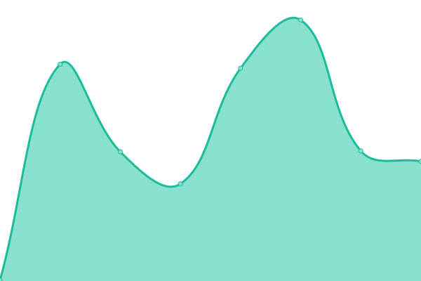
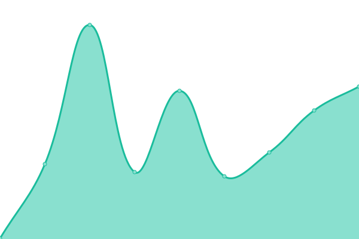
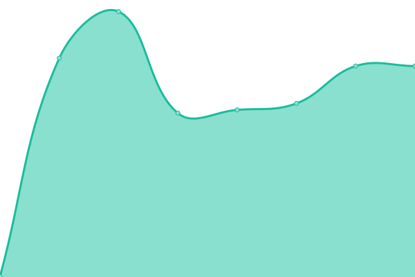
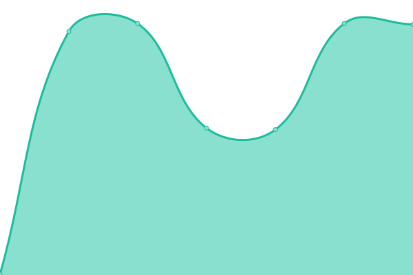
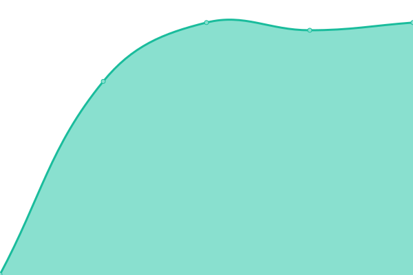
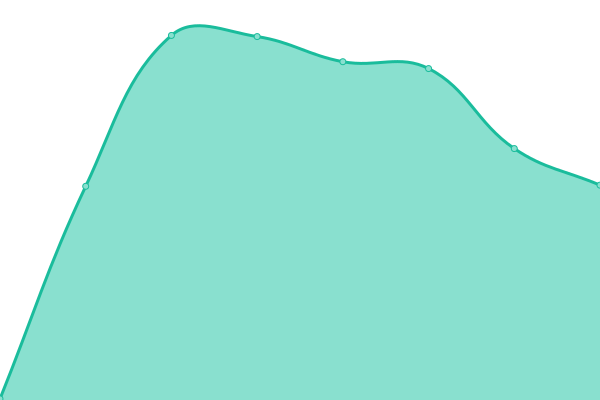
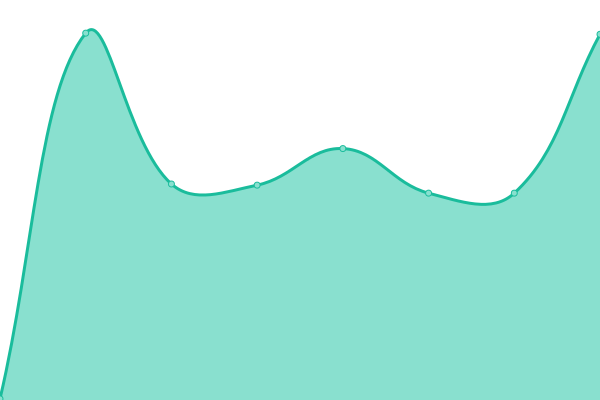

# [📈 Live Status](https://mewwme.github.io/upptime): <!--live status--> **🟧 Partial outage**

This repository contains the open-source uptime monitor and status page for [Mewwme's](https://meww.me), powered by [Upptime](https://github.com/upptime/upptime).

With [Upptime](https://upptime.js.org), you can get your own unlimited and free uptime monitor and status page, powered entirely by a GitHub repository. We use [Issues](https://github.com/mewwme/upptime/issues) as incident reports, [Actions](https://github.com/mewwme/upptime/actions) as uptime monitors, and [Pages](https://mewwme.github.io/upptime) for the status page.

<!--start: status pages-->
<!-- This summary is generated by Upptime (https://github.com/upptime/upptime) -->
<!-- Do not edit this manually, your changes will be overwritten -->
<!-- prettier-ignore -->
| URL | Status | History | Response Time | Uptime |
| --- | ------ | ------- | ------------- | ------ |
|  [Mewwme Website](https://meww.me) | 🟩 Up | [mewwme-website.yml](https://github.com/mewwme/upptime/commits/HEAD/history/mewwme-website.yml) | 

 210ms
     
 | 

<a href="https://mewwme.github.io/upptime/history/mewwme-website">100.00%</a>
    

|  [Mewwme Docs](https://docs.meww.me) | 🟩 Up | [mewwme-docs.yml](https://github.com/mewwme/upptime/commits/HEAD/history/mewwme-docs.yml) | 

 128ms
     
 | 

<a href="https://mewwme.github.io/upptime/history/mewwme-docs">100.00%</a>
    

|  [Mewwme's](http://168.119.88.145:3026) | 🟥 Down | [mewwme-s.yml](https://github.com/mewwme/upptime/commits/HEAD/history/mewwme-s.yml) | 

 185ms
     
 | 

<a href="https://mewwme.github.io/upptime/history/mewwme-s">77.99%</a>
    

|  [Mewwme's [1]](http://168.119.88.145:3004) | 🟥 Down | [mewwme-s-1.yml](https://github.com/mewwme/upptime/commits/HEAD/history/mewwme-s-1.yml) | 

 184ms
     
 | 

<a href="https://mewwme.github.io/upptime/history/mewwme-s-1">78.20%</a>
    

|  [Mewwme's [2]](http://168.119.88.145:3009) | 🟥 Down | [mewwme-s-2.yml](https://github.com/mewwme/upptime/commits/HEAD/history/mewwme-s-2.yml) | 

 184ms
     
 | 

<a href="https://mewwme.github.io/upptime/history/mewwme-s-2">78.21%</a>
    

|  [Mewwme's [3]](http://168.119.88.145:3011) | 🟥 Down | [mewwme-s-3.yml](https://github.com/mewwme/upptime/commits/HEAD/history/mewwme-s-3.yml) | 

 184ms
     
 | 

<a href="https://mewwme.github.io/upptime/history/mewwme-s-3">78.21%</a>
    

|  [Mewwme's [4]](http://168.119.88.145:3012) | 🟥 Down | [mewwme-s-4.yml](https://github.com/mewwme/upptime/commits/HEAD/history/mewwme-s-4.yml) | 

 184ms
     
 | 

<a href="https://mewwme.github.io/upptime/history/mewwme-s-4">78.22%</a>
    

<!--end: status pages-->

[**Visit our status website →**](https://mewwme.github.io/uptime)

## 📄 License

- Powered by: [Upptime](https://github.com/upptime/upptime)
- Code: [MIT](./LICENSE) © [Anand Chowdhary](https://anandchowdhary.com), supported by [Pabio](https://pabio.com)
- Data in the `./history` directory: [Open Database License](https://opendatacommons.org/licenses/odbl/1-0/)
